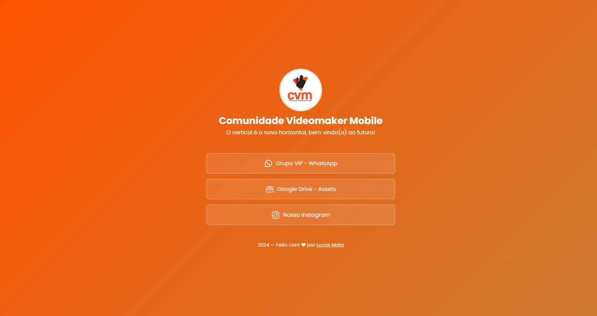

<h1 align="center"> CVM Links </h1>

Página de links para a maior comunidade de audiovisual mobile brasileira. 

  <a href="#-projeto">Projeto</a>&nbsp;&nbsp;&nbsp;|&nbsp;&nbsp;
  <a href="#-tecnologias">Tecnologias</a>&nbsp;&nbsp;&nbsp;

 

  

## 💻 Projeto

O projeto é um agregador de links para usar como cartão de visitas online.

## 🚀 Tecnologias

Esse projeto foi desenvolvido com as seguintes tecnologias:

- HTML e CSS
- JavaScript
- Git e Github
- Figma

---

Feito com ♥ [Lucas Mota](https://github.com/lmdvlpr)
